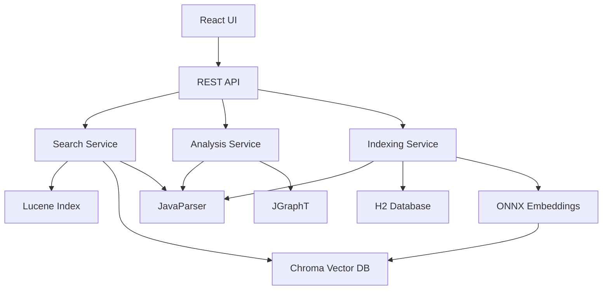
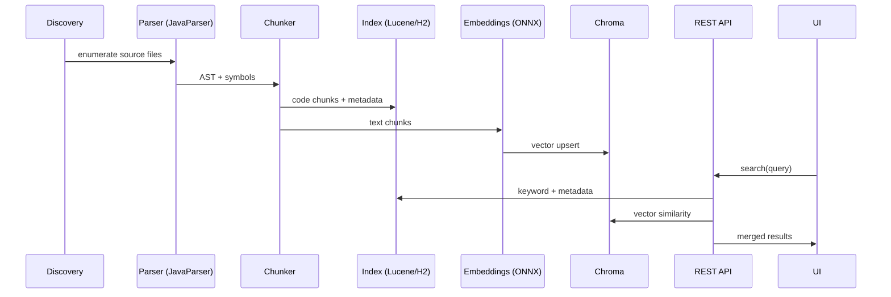
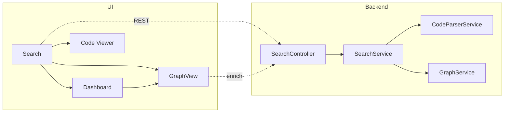

# Architecture

This document captures the current high-level system architecture, core components, data flow, and key design decisions.

## Technology Stack

- Backend: Spring Boot 3.5.x (Java 21), H2, Lucene, JavaParser, JGraphT
- Embeddings/ML: ONNX runtime-based embeddings stored in Chroma
- UI: Vite + React 18 + TypeScript, Cytoscape.js, Recharts, Monaco
- Build/Test: Maven + JUnit 5, JaCoCo; UI uses Vite/Vitest/RTL

## System Overview

## Data Flow

1) Discover → 2) Parse → 3) Chunk → 4) Index → 5) Embed → 6) Search/Query → 7) Visualize (graph, dashboard)

## Components and Relationships

- UI
	- Search page, Dashboard, Graph visualization, Code viewer
	- GraphView uses Cytoscape with type styling, layout presets, and keyboard help
- API
	- SearchController, Indexing endpoints, Analysis endpoints
- Services
	- SearchService (Lucene + Chroma), CodeParserService (JavaParser), GraphService (JGraphT)

## Design Decisions

- Keep search hybrid: keyword (Lucene) + semantic (Chroma)
- Prefer simple, explainable chunking and deterministic graph derivation (JGraphT)
- Store embeddings outside the relational DB for scalability (Chroma)
- Optimize UI bundle with vendor chunk splits for faster loads
- Persist user graph preferences locally to reduce friction

## Notes

- For API shapes and examples, see `docs/API.md` and `docs/api/mocks/`
- For test coverage goals, see `docs/coverage-goals.md`
