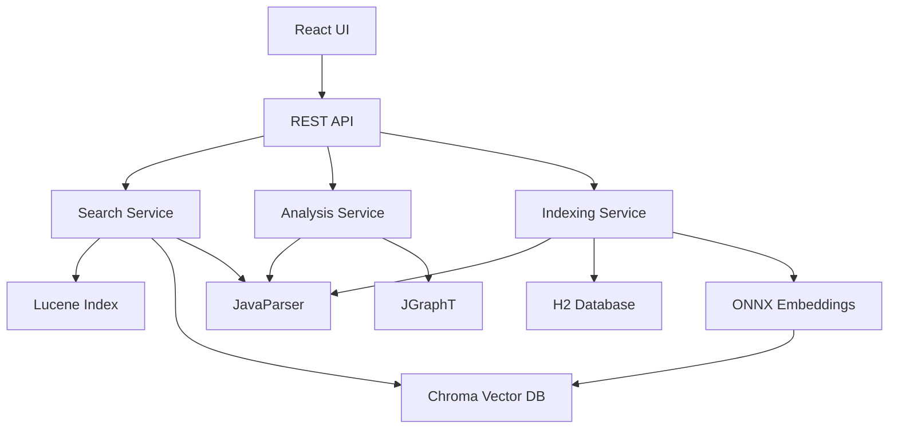

# Firestick Architecture

## System Overview

```mermaid
graph TB
    UI[React UI] --> API[REST API]
    API --> Search[Search Service]
    API --> Analysis[Analysis Service]
    API --> Index[Indexing Service]
    Search --> Lucene[Lucene Index]
    Search --> Chroma[Chroma Vector DB]
    Search --> Parser[JavaParser]
    Analysis --> Parser
    Analysis --> Graph[JGraphT]
    Index --> Parser
    Index --> H2[H2 Database]
    Index --> Embedding[ONNX Embeddings]
    Embedding --> Chroma
```

## Components

### Frontend
- **React 18**: Modern UI framework
- **Material-UI**: Component library
- **Monaco Editor**: Code viewer
- **React Flow**: Graph visualization

### Backend
- **Spring Boot 3.5**: Application framework
- **JavaParser**: Code parsing
- **Apache Lucene**: Full-text search
- **JGraphT**: Dependency graphs

### Data Layer
- **H2 Database**: Code metadata storage
- **Chroma**: Vector similarity search
- **ONNX Runtime**: Embedding generation

## Data Flow
1. User submits code/query via UI
2. Backend parses code, analyzes, indexes, and returns results
3. UI displays results and visualizations

## Design Decisions
- Chose Spring Boot for rapid backend development and integration.
- React selected for modern, maintainable frontend.
- Lucene and Chroma provide both traditional and vector search.
- JavaParser and JGraphT enable deep code analysis and visualization.
- H2 is used for fast, in-memory prototyping; can be swapped for production DB.
