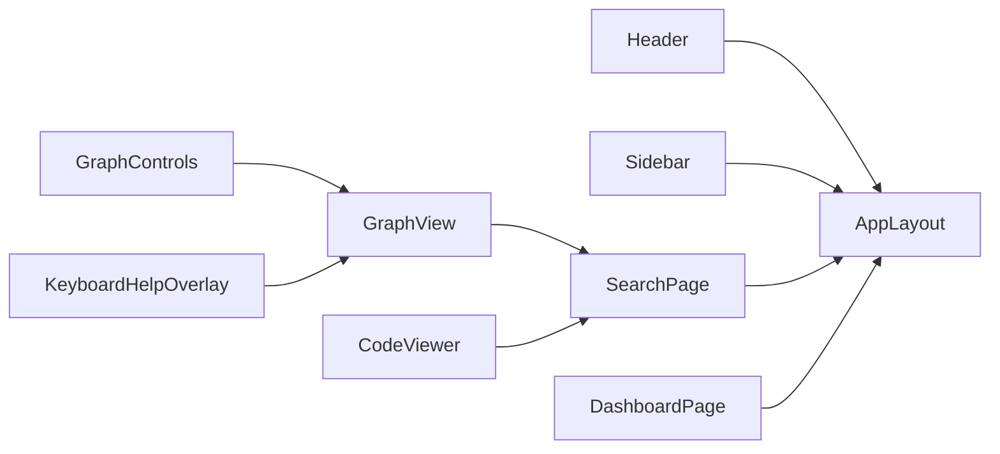

# UI Component Structure

This document lists the key UI components, proposed hierarchy, and responsibilities.

## Component List

Layout
- AppLayout (header, sidebar, main)
- Header
- Sidebar
- Footer

Search
- SearchPage
- SearchInput (with autocomplete)
- SearchFilters
- SearchResults
- ResultItem

Graph
- GraphView (Cytoscape wrapper)
- GraphControls (legend, layout, presets, export)
- KeyboardHelpOverlay

Dashboard
- DashboardPage
- HotspotsChart (Recharts)
- TrendsChart

Code
- CodeViewer (Monaco)

## Hierarchy

## Responsibilities

- Keep GraphControls stateless; persist preferences in localStorage at GraphView level
- SearchPage owns query state; Results subscribe
- Dashboard charts link to Search with pre-filled filters
