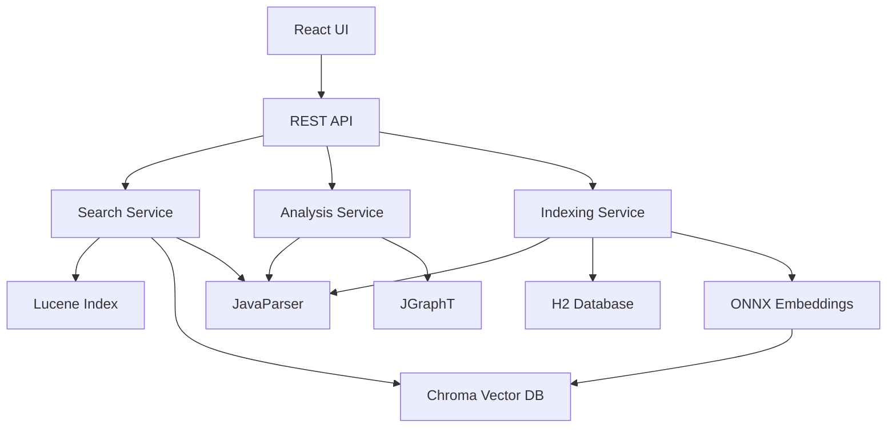

# Firestick - Developer 2 Tasks (Frontend Focus)

**Developer:** Developer 2 (Frontend Lead)  
**Version:** 1.0  
**Date:** October 14, 2025  
**Project:** Firestick - Legacy Code Analysis and Search Tool  
**Repository:** firestick (CaveAnimal/firestick)  
**Assignment:** Web UI, Desktop Packaging, User Experience

---

## Task Summary (DEV2)

**Total Tasks:** 245 tasks (including main tasks and sub-tasks)  
**Completed/Tested:** 236 tasks  
**In Progress:** 1 tasks  
**Blocked:** 1 tasks  
**Percent Complete:** 96.33%  
**Last Updated:** November 6, 2025    2:31 PM Central Standard Time

## Developer 2 Task Summary

**Role:** Frontend Development Lead  
**Primary Focus:** React UI, user experience, desktop packaging, deployment  
**Total Estimated Tasks:** ~873 tasks (50% of 1,747 total tasks)  
**Dependencies:** Coordinate with Developer 1 for API contracts and data requirements  

**Your Phases:**
- ✅ Phase 1: Foundation - Testing & Documentation (Weeks 1-2)
- 🔧 Phase 5: Web UI (Weeks 9-10)
- 🔧 Phase 6: Desktop Packaging (Weeks 10-11)
- 🔧 Phase 7: Optimization & Polish - Frontend Performance (Week 12)

**Developer 1's Phases (for reference):**
- Phase 1: Foundation - Backend Infrastructure (Weeks 1-2)
- Phase 2: Code Indexing Engine (Weeks 3-4)
- Phase 3: Search Engine (Weeks 5-6)
- Phase 4: Analysis Features (Weeks 7-8)
- Phase 7: Optimization & Polish - Backend Performance (Week 12)

---

## Coordination Points

### Week 2 (Day 9-10): API Contract Definition
**With Developer 1:**
- Define REST API endpoints together
- Agree on request/response schemas
- Document error codes and handling
- Create OpenAPI/Swagger specification
- Plan data structures for UI needs

### Week 8 (Day 38-40): Integration Checkpoint
**With Developer 1:**
- Verify backend APIs are ready for integration
- Test API responses with frontend expectations
- Coordinate error handling approaches
- Plan for Phase 5 UI development kickoff

### Week 12 (Day 68-69): Final Integration
**With Developer 1:**
- End-to-end testing across full stack
- Performance optimization coordination
- Bug fixes and final polish
- Final QA before release

---

## Task Status Symbols
- `[ ]` Not Started
- `[-]` In Progress
- `[X]` Completed
- `[V]` Tested & Verified
- `[!]` Blocked
- `[>]` Deferred (include reason on next line)

---

## Phase 1: Foundation - Testing & Documentation (Weeks 1-2)

**Your Responsibility:** Testing framework, documentation, project setup validation  
**Duration:** Oct 6-20, 2025 (2 weeks)  
**Parallel Work:** Developer 1 handles backend services and infrastructure

---

### Week 1: Testing Framework Setup

#### Day 1-3: Project Validation & Test Framework Setup
**Goal:** Ensure project setup is correct and establish testing foundation

- `[X]` **Validate Project Setup** (2h)
	- `[X]` Sub-task: Clone repository and verify structure
	- `[X]` Sub-task: Verify Maven build works: `mvn clean install`
	- `[V]` Sub-task: Check all dependencies are resolved
	- `[V]` Sub-task: Verify Java 21 is being used
	- `[X]` Sub-task: Document any setup issues
	- `[X]` Sub-task: Verify application runs: `mvn spring-boot:run`

- `[X]` **Set Up JUnit 5 Testing** (3h)
	- `[V]` Sub-task: Verify JUnit 5 is in pom.xml
	- `[X]` Sub-task: Add Mockito for mocking: `mockito-core` version 5.14.2
	- `[X]` Sub-task: Add AssertJ for fluent assertions
	- `[V]` Sub-task: Configure test resource directories
	- `[X]` Sub-task: Create base test class with common setup
	- `[V]` Sub-task: Run sample test to verify setup

**Test Dependencies:**
```xml
<!-- Add to pom.xml -->
<dependencies>
		<!-- JUnit 5 -->
		<dependency>
				<groupId>org.junit.jupiter</groupId>
				<artifactId>junit-jupiter</artifactId>
				<scope>test</scope>
		</dependency>
    
		<!-- Mockito -->
		<dependency>
				<groupId>org.mockito</groupId>
				<artifactId>mockito-core</artifactId>
				<version>5.14.2</version>
				<scope>test</scope>
		</dependency>
    
		<!-- AssertJ -->
		<dependency>
				<groupId>org.assertj</groupId>
				<artifactId>assertj-core</artifactId>
				<version>3.24.2</version>
				<scope>test</scope>
		</dependency>
    
		<!-- Spring Boot Test -->
		<dependency>
				<groupId>org.springframework.boot</groupId>
				<artifactId>spring-boot-starter-test</artifactId>
				<scope>test</scope>
		</dependency>
</dependencies>
```

- `[X]` **Create Test Utilities** (3h)
	- `[X]` Sub-task: Create `TestDataBuilder` class for test data
	- `[X]` Sub-task: Create sample Java files for testing
	- `[X]` Sub-task: Create helper methods for common test operations
	- `[X]` Sub-task: Set up test configuration files
	- `[X]` Sub-task: Document testing standards and conventions

**Test Utilities Example:**
```java
// src/test/java/com/codetalker/firestick/TestDataBuilder.java
package com.codetalker.firestick;

import java.nio.file.Path;
import java.nio.file.Files;
import java.io.IOException;

public class TestDataBuilder {
    
		public static Path createTempJavaFile(String className, String content) throws IOException {
				Path tempFile = Files.createTempFile(className, ".java");
				Files.writeString(tempFile, content);
				return tempFile;
		}
    
		public static String sampleClassCode(String className) {
				return """
						package com.example;
            
						public class %s {
								private String name;
                
								public %s(String name) {
										this.name = name;
								}
                
								public String getName() {
										return name;
								}
                
								public void setName(String name) {
										this.name = name;
								}
						}
						""".formatted(className, className);
		}
    
		public static String sampleMethodCode() {
				return """
						public int calculate(int a, int b) {
								int result = 0;
								for (int i = 0; i < a; i++) {
										result += b;
								}
								return result;
						}
						""";
		}
}
```

---

#### Day 4-5: Integration Test Setup
**Goal:** Set up integration testing infrastructure

- `[X]` **Configure Integration Tests** (3h)
	- `[X]` Sub-task: Create integration test package structure
	- `[X]` Sub-task: Add `@SpringBootTest` annotation configuration
	- `[X]` Sub-task: Set up test database (H2 in-memory)
	- `[X]` Sub-task: Configure test application properties
	- `[X]` Sub-task: Create base integration test class
	- `[X]` Sub-task: Write sample integration test

**Integration Test Configuration:**
```java
// src/test/java/com/codetalker/firestick/integration/BaseIntegrationTest.java
package com.codetalker.firestick.integration;

import org.springframework.boot.test.context.SpringBootTest;
import org.springframework.test.context.TestPropertySource;
import org.junit.jupiter.api.extension.ExtendWith;
import org.springframework.test.context.junit.jupiter.SpringExtension;

@ExtendWith(SpringExtension.class)
@SpringBootTest(webEnvironment = SpringBootTest.WebEnvironment.RANDOM_PORT)
@TestPropertySource(locations = "classpath:application-test.properties")
public abstract class BaseIntegrationTest {
		// Common setup for all integration tests
}
```

```properties
# src/test/resources/application-test.properties
spring.datasource.url=jdbc:h2:mem:testdb
spring.datasource.driverClassName=org.h2.Driver
spring.jpa.hibernate.ddl-auto=create-drop
spring.jpa.show-sql=true
logging.level.root=INFO
```

 - `[X]` **Set Up Test Coverage** (2h)
	- `[X]` Sub-task: Add JaCoCo plugin to pom.xml
	- `[X]` Sub-task: Configure coverage thresholds
		- `[X]` Sub-task: Generate coverage report: `mvn test jacoco:report`
		- `[X]` Sub-task: View coverage in `target/site/jacoco/index.html`
	- `[X]` Sub-task: Document coverage goals (aim for >80%)

**JaCoCo Configuration:**
```xml
<!-- Add to pom.xml -->
<build>
		<plugins>
				<plugin>
						<groupId>org.jacoco</groupId>
						<artifactId>jacoco-maven-plugin</artifactId>
						<version>0.8.11</version>
						<executions>
								<execution>
										<goals>
												<goal>prepare-agent</goal>
										</goals>
								</execution>
								<execution>
										<id>report</id>
										<phase>test</phase>
										<goals>
												<goal>report</goal>
										</goals>
								</execution>
								<execution>
										<id>jacoco-check</id>
										<goals>
												<goal>check</goal>
										</goals>
										<configuration>
												<rules>
														<rule>
																<element>PACKAGE</element>
																<limits>
																		<limit>
																				<counter>LINE</counter>
																				<value>COVEREDRATIO</value>
																				<minimum>0.80</minimum>
																		</limit>
																</limits>
														</rule>
												</rules>
										</configuration>
								</execution>
						</executions>
				</plugin>
		</plugins>
</build>
```

- `[X]` **Create API Test Suite** (3h)
	- `[V]` Sub-task: Set up REST API testing with MockMvc
	- `[V]` Sub-task: Create test for health endpoint
	- `[X]` Sub-task: Add tests for future search endpoints
		- `[V]` Sub-task: Add tests for error scenarios
	- `[X]` Sub-task: Document API testing patterns

**API Test Example:**

```java
// src/test/java/com/codetalker/firestick/controller/HealthControllerTest.java
package com.codetalker.firestick.controller;

import com.codetalker.firestick.controller.HealthController;
import org.junit.jupiter.api.Test;
import org.springframework.beans.factory.annotation.Autowired;
import org.springframework.boot.test.autoconfigure.web.servlet.WebMvcTest;
import org.springframework.test.web.servlet.MockMvc;

import static org.springframework.test.web.servlet.request.MockMvcRequestBuilders.get;
import static org.springframework.test.web.servlet.result.MockMvcResultMatchers.*;

@WebMvcTest(HealthController.class)
class HealthControllerTest {

		@Autowired
		private MockMvc mockMvc;

		@Test
		void healthEndpoint_ShouldReturnOK() throws Exception {
				mockMvc.perform(get("/health"))
								.andExpect(status().isOk())
								.andExpect(content().string("OK"));
		}
}
```

---

### Week 2: Documentation & Planning

#### Day 6-7: Documentation Setup
**Goal:** Create comprehensive project documentation structure

- `[X]` **Create README.md** (3h)
	- `[X]` Sub-task: Add project overview and description
	- `[X]` Sub-task: Add system requirements
	- `[X]` Sub-task: Add installation instructions
	- `[X]` Sub-task: Add quick start guide
	- `[X]` Sub-task: Add build instructions
	- `[X]` Sub-task: Add contribution guidelines
	- `[X]` Sub-task: Add license information

**README Template:**
```markdown
# Firestick - Legacy Code Analysis and Search Tool

## Overview
Firestick is a powerful desktop application for analyzing and searching legacy codebases using semantic search, code metrics, and dependency analysis.

## Features
- 🔍 Semantic code search with AI embeddings
- 📊 Code complexity analysis
- 🕸️ Dependency graph visualization
- 💡 Code smell detection
- 🎯 Dead code identification
- 🖥️ Modern web-based UI

## System Requirements
- Java 21+
- Maven 3.8+
- Node.js 18+ (for UI development)
- 4GB RAM recommended

## Quick Start

### Build and Run
```bash
# Clone repository
git clone https://github.com/CaveAnimal/firestick.git
cd firestick

# Build backend
mvn clean package

# Run application
mvn spring-boot:run

# Access UI at http://localhost:8080
```

### Development Setup
See [DEVELOPMENT.md](docs/DEVELOPMENT.md) for detailed setup instructions.

## Documentation
- [User Guide](docs/USER_GUIDE.md)
- [Developer Guide](docs/DEVELOPER_GUIDE.md)
- [API Documentation](docs/API.md)
- [Architecture](docs/ARCHITECTURE.md)

## Contributing
See [CONTRIBUTING.md](CONTRIBUTING.md)

## License
MIT License - see [LICENSE](LICENSE)
```

- `[X]` **Create docs/ Directory Structure** (2h)
	- `[X]` Sub-task: Create `docs/` directory
	- `[X]` Sub-task: Create `ARCHITECTURE.md` (placeholder)
	- `[X]` Sub-task: Create `DEVELOPER_GUIDE.md` (placeholder)
	- `[X]` Sub-task: Create `USER_GUIDE.md` (placeholder)
	- `[X]` Sub-task: Create `API.md` (placeholder)
	- `[X]` Sub-task: Create `CONTRIBUTING.md`
    
	- `[X]` **Create docs/ Directory Structure** (2h)

- `[X]` **Document Architecture** (3h)
	- `[X]` Sub-task: Create high-level architecture diagram
	- `[X]` Sub-task: Document technology stack
	- `[X]` Sub-task: Document data flow
	- `[X]` Sub-task: Document component relationships
	- `[X]` Sub-task: Document design decisions
	- `[X]` Sub-task: Add diagrams (using Mermaid or draw.io)

**Architecture Diagram Example (Mermaid):**
```markdown
# Architecture

## System Overview



## Components

### Frontend
- **React 18**: Modern UI framework
- **Material-UI**: Component library
- **Monaco Editor**: Code viewer
- **React Flow**: Graph visualization

### Backend
- **Spring Boot 3.5**: Application framework
- **JavaParser**: Code parsing
- **Apache Lucene**: Full-text search
- **JGraphT**: Dependency graphs

### Data Layer
- **H2 Database**: Code metadata storage
- **Chroma**: Vector similarity search
- **ONNX Runtime**: Embedding generation
```

#### Day 8: API Contract Planning
**Goal:** Plan API contracts with Developer 1

- `[X]` **Design API Endpoints** (3h - COORDINATION)
	- `[X]` Sub-task: Meet with Developer 1 to design API
	- `[X]` Sub-task: Document search endpoints
	- `[X]` Sub-task: Document analysis endpoints
	- `[X]` Sub-task: Document indexing endpoints
	- `[X]` Sub-task: Document file access endpoints
	- `[X]` Sub-task: Define request/response schemas

**API Contract Example:**
```yaml
# API Contract (OpenAPI/Swagger format)

/api/search:
	post:
		summary: Search code
		requestBody:
			content:
				application/json:
					schema:
						type: object
						properties:
							query:
								type: string
								description: Search query
							topK:
								type: integer
								description: Number of results
								default: 10
							filter:
								type: object
								description: Optional filters
		responses:
			200:
				description: Search results
				content:
					application/json:
						schema:
							type: object
							properties:
								results:
									type: array
									items:
										type: object
										properties:
											id: string
											content: string
											filePath: string
											lineNumber: integer
											score: number

/api/analysis/complexity:
	get:
		summary: Get complexity metrics
		responses:
			200:
				description: Complexity analysis
				content:
					application/json:
						schema:
							type: object
							properties:
								average: number
								max: number
								histogram: object
```

- `[X]` **Create API Mock Data** (2h)
	- `[X]` Sub-task: Create mock responses for search
	- `[X]` Sub-task: Create mock responses for analysis
	- `[X]` Sub-task: Create mock responses for graph data
	- `[X]` Sub-task: Save mocks for frontend development
	- `[X]` Sub-task: Document mock data usage

- `[X]` **Document Error Handling** (1h)
	- `[X]` Sub-task: Define error response format
	- `[X]` Sub-task: Document error codes
	- `[X]` Sub-task: Document error messages
	- `[X]` Sub-task: Plan frontend error handling
	- `[X]` Sub-task: Create error handling guide

---

#### Day 9-10: UI Planning & Design
**Goal:** Plan UI architecture and design system

- `[X]` **Create UI Wireframes** (3h)
	- `[X]` Sub-task: Sketch search page layout
	- `[X]` Sub-task: Sketch analysis dashboard layout
	- `[X]` Sub-task: Sketch code viewer layout
	- `[X]` Sub-task: Sketch dependency graph layout
	- `[X]` Sub-task: Sketch settings page layout
	- `[X]` Sub-task: Use Figma, draw.io, or pen & paper

- `[X]` **Define Design System** (3h)
	- `[X]` Sub-task: Choose color palette
	- `[X]` Sub-task: Define typography scale
	- `[X]` Sub-task: Define spacing system
	- `[X]` Sub-task: Choose UI component library (Material-UI recommended)
	- `[X]` Sub-task: Document design tokens
	- `[X]` Sub-task: Create design system reference

**Design System Example:**
```javascript
// theme.js - Design tokens
export const theme = {
	colors: {
		primary: '#2196f3',
		secondary: '#f50057',
		success: '#4caf50',
		warning: '#ff9800',
		error: '#f44336',
		background: '#fafafa',
		surface: '#ffffff',
		text: {
			primary: 'rgba(0, 0, 0, 0.87)',
			secondary: 'rgba(0, 0, 0, 0.54)',
			disabled: 'rgba(0, 0, 0, 0.38)',
		},
	},
	spacing: {
		xs: '4px',
		sm: '8px',
		md: '16px',
		lg: '24px',
		xl: '32px',
	},
	typography: {
		fontFamily: '"Roboto", "Helvetica", "Arial", sans-serif',
		h1: { fontSize: '2.5rem', fontWeight: 500 },
		h2: { fontSize: '2rem', fontWeight: 500 },
		h3: { fontSize: '1.75rem', fontWeight: 500 },
		body1: { fontSize: '1rem', fontWeight: 400 },
		body2: { fontSize: '0.875rem', fontWeight: 400 },
	},
};
```

- `[X]` **Plan Component Structure** (2h)
	- `[X]` Sub-task: List all UI components needed
	- `[X]` Sub-task: Define component hierarchy
	- `[X]` Sub-task: Plan reusable components
	- `[X]` Sub-task: Document component responsibilities
	- `[X]` Sub-task: Create component diagram

**Component List:**
```
Layout Components:
- AppLayout (header, sidebar, main)
- Header
- Sidebar
- Footer

Search Components:
- SearchPage
- SearchInput (with autocomplete)
- SearchFilters
- SearchResults
- ResultCard

Code Viewer Components:
- CodeViewer (Monaco Editor wrapper)
- CodeNavigation
- FileBreadcrumb

Analysis Components:
- AnalysisDashboard
- ComplexityWidget
- CodeSmellsWidget
- DeadCodeWidget
- QualityScoreCard

Graph Components:
- DependencyGraph
- GraphControls
- GraphLegend

Settings Components:
- SettingsPage
- IndexingSettings
- SearchSettings
- AppearanceSettings

Common Components:
- Button
- Input
- Select
- Checkbox
- Modal
- Toast/Notification
- Loading (skeleton, spinner)
- ErrorBoundary
```

---

## Phase 5: Web UI (Weeks 9-10)

**Your Responsibility:** Complete React web interface  
**Duration:** Dec 9 - Dec 22, 2025 (2 weeks)  
**Dependencies:** Backend APIs from Phase 3 and Phase 4 must be ready

### Week 11 Detailed Tasks

#### Day 1: UI Setup & Design
- [X] Create React application (2h)
	- [X] Create React App or Vite setup
	- [X] Configure proxy to Spring Boot backend
	- [X] Set up routing (React Router)
- [X] Design UI mockups/wireframes (4h)
- [X] Set up component library (Material-UI or Bootstrap) (2h)
- [X] Create base layout components (4h)
	- [X] Header/Navigation
	- [X] Sidebar
	- [X] Main content area
	- [X] Footer

#### Day 2-3: Search Interface
- [X] Create search page components (12h)
	- [X] Search bar with autocomplete
	- [X] Search filters
	- [X] Result list with pagination
	- [X] Result item with code preview
	- [X] Syntax highlighting integration
- [X] Connect to search API (4h)
- [X] Implement search state management (Redux/Context) (4h)

#### Day 4: Code Viewer
- [X] Integrate Monaco Editor (6h)
	- [X] Code display with syntax highlighting
	- [X] Line numbers and highlighting
	- [X] Read-only mode
	- [X] Copy functionality
- [X] Create code viewer modal/panel (4h)
- [X] Connect to backend for full file content (2h)

#### Day 5: Graph Visualization Foundation
- [X] Research and select graph library (2h)
	- [X] D3.js vs Cytoscape.js evaluation (selected Cytoscape)
- [X] Create graph visualization component (8h)
	- [X] Basic graph rendering
	- [X] Node and edge styling
	- [X] Layout algorithms
- [X] Create graph controls (zoom, pan, reset) (2h)

### Week 12 Detailed Tasks

#### Day 1-2: Graph Features
- [X] Enhance graph visualization (10h)
	- [X] Interactive node selection
	- [X] Edge hover details
	- [X] Filtering and focusing
	- [X] Export as image (PNG/SVG)
- [X] Connect to dependency API (4h)
- [X] Create graph legend and controls (2h)
- [X] Performance optimization for large graphs (4h)

#### Day 3: Analysis Dashboard
- [X] Create dashboard page (8h)
	- [X] Project statistics widgets
	- [X] Complexity charts (Chart.js/Recharts)
	- [X] Hotspot list
	- [X] Quick action buttons
- [X] Connect to dashboard API (2h)
- [X] Responsive layout for dashboard (2h)

#### Day 4: Indexing Console
- [X] Create indexing console page (8h)
	- [X] Trigger indexing button
	- [X] Progress bar with real-time updates
	- [X] Indexing statistics display
	- [X] Configuration options
	- [X] Job history
- [X] WebSocket integration for progress updates (4h)
- [X] Connect to indexing API (2h)

#### Day 5: Polish & Testing
- [X] Responsive design for mobile/tablet (6h)
- [X] Error handling and user feedback (4h)
- [X] Loading states and animations (2h)
- [X] Cross-browser testing (4h)

---

## Phase 6: Desktop Packaging (Weeks 10-11)

**Your Responsibility:** Desktop packaging, installers, deployment  
**Duration:** Dec 22, 2025 - Jan 4, 2026 (2 weeks)  
**Dependencies:** Phase 5 (Web UI) complete

(Include all packaging tasks from original firestickTASKS.md Phase 6 - Days 55-62)

---

## Phase 7: Optimization & Polish - Frontend (Week 12)

**Your Responsibility:** Frontend performance, UX polish, accessibility  
**Duration:** Jan 5-11, 2026 (1 week)

### Day 64: Frontend Performance Optimization
- `[X]` Optimize React Bundle Size (2h)
- `[X]` Optimize React Rendering (3h)
- `[X]` Optimize API Calls (2h)
- `[X]` Add Loading Optimizations (1h)

### Day 65: User Experience Improvements
- `[X]` Improve Error Handling (2h)
- `[X]` Add Keyboard Shortcuts (2h)
- `[X]` Improve Loading States (2h)
 - `[X]` Add User Feedback (2h)
 - `[X]` Add User Feedback (2h)

### Day 66: Accessibility & Browser Compatibility
- `[X]` Accessibility Audit (3h)
- `[X]` Cross-Browser Testing (2h)
- `[X]` Mobile Responsiveness (2h)
- `[X]` Add Print Styles (1h)

### Day 69: UI Polish
- `[X]` Fix alignment and spacing issues (2h)
- `[X]` Ensure consistent styling (1h)
- `[X]` Improve animations and transitions (1h)

---

## Daily Standup Template

**Today's Focus:**
- [X] Task 1
- [X] Task 2
- [X] Task 3

**Coordination with Developer 1:**
- [X] Backend API status check
- [X] Data format discussions
- [X] Integration issues

**Blockers:**
- None / [List blockers]

**Notes:**
- [Any important notes or decisions]

---

**Last Updated:** October 22, 2025  
**Next Review:** [Date]  
**Questions:** Contact Developer 1 for backend/API questions


<!-- @anchor:dev2-recommendations-backlog -->
## Recommendations Backlog (ttask)

These are targeted, low-risk improvements to increase quality and CI confidence. Tracked as tasks in ttask style so they’re visible to the summary scripts.

- `[X]` ttask: Publish JaCoCo coverage and Surefire reports in CI (HTML + XML artifacts)
	- `[X]` Sub-task: Enable JaCoCo XML report output (for CI parsing)
	- `[X]` Sub-task: Publish `target/site/jacoco` and `target/surefire-reports` as CI artifacts
	- `[X]` Sub-task: Add coverage badge generation step (optional)

- `[X]` ttask: Add OpenAPI generation via springdoc-openapi
	- `[X]` Sub-task: Add springdoc dependency and auto-generate `/v3/api-docs` and `/swagger-ui`
	- `[X]` Sub-task: Add Swagger UI availability test (MockMvc GET `/swagger-ui/index.html` → 200)
	- `[X]` Sub-task: Host static OpenAPI JSON as build artifact for UI mocks
	- `[X]` Sub-task: Add contract drift check in CI (fail if endpoints undocumented)

- `[X]` ttask: Expand API tests for error scenarios across controllers
	- `[X]` Sub-task: Validate 4xx mapping for validation errors (ControllerAdvice)
	- `[X]` Sub-task: Validate 5xx mapping for unexpected exceptions
	- `[X]` Sub-task: Verify consistent error schema (code, message, details)

- `[X]` ttask: Add UI linting and formatting
	- `[X]` Sub-task: Add ESLint + Prettier to `ui/` with recommended + react rules
	- `[X]` Sub-task: Add `lint` and `format:check` scripts; wire into CI
	- `[X]` Sub-task: Add pre-commit hook (Husky) for lint-staged

- `[X]` ttask: Add UI unit testing foundation
	- `[X]` Sub-task: Add Vitest + React Testing Library to `ui/`
	- `[X]` Sub-task: Create first smoke test (App renders)
	- `[X]` Sub-task: Add CI `test:unit` step with JUnit-style output

- `[X]` ttask: Optional e2e smoke via Playwright
	- `[X]` Sub-task: Add Playwright with a minimal “open home → search → result renders” test
	- `[X]` Sub-task: Add CI e2e job flagged as optional/non-blocking initially

---

## Additional Recommendations (ttask)

- `[X]` ttask: Add Java format/lint enforcement for backend
	- `[X]` Sub-task: Add Spotless Maven plugin with Google Java Style (check + apply)
	- `[X]` Sub-task: Wire Spotless check into CI

- `[X]` ttask: Add dependency vulnerability scanning in CI
	- `[X]` Sub-task: Integrate OWASP Dependency-Check Maven plugin
	- `[X]` Sub-task: Upload generated reports as CI artifacts; fail on high severity

- `[X]` ttask: Add OpenAPI schema validation in CI
	- `[X]` Sub-task: Validate `openapi.json` with `swagger-cli` (or spectral) as a CI step
	- `[X]` Sub-task: Fail CI on invalid schema

- `[X]` ttask: Add OpenAPI contract drift check in CI
	- `[X]` Sub-task: Commit baseline `docs/openapi/openapi.json`
	- `[X]` Sub-task: Compare generated vs baseline in CI and fail on drift

- `[X]` ttask: Enable automated dependency updates
	- `[X]` Sub-task: Configure Dependabot or Renovate for Maven and npm workspaces
	- `[X]` Sub-task: Add labels/rules to triage update PRs

---

## Optional Enhancements (Regular Tasks)

These are optional but valuable improvements. Tracked in regular task style to surface in summaries.

- [X] Graph: Legend items toggle visibility (click to show/hide node and edge types)
- [X] Graph: Layout selector (breadthfirst, cose, circle, concentric, grid)
- [X] Graph: Persist preferences (node/edge visibility, includes, layout) in localStorage
- [X] Graph: Minimap/overview pane for large graphs
- [X] Graph: Export current graph data as JSON
- [X] Graph: Shortest path tool between two nodes
- [X] Graph: Edge visibility presets (Structure-only, Calls-only, All)
- [X] Accessibility: Keyboard shortcut help overlay (“?”)
- [X] Search: Recent searches saved locally with quick recall
 - [X] Search: Recent searches saved locally with quick recall
- [X] Dashboard: Drill-down from hotspots to file/method view
- [ ] Indexing: Cancel active job from UI (requires backend support)
- [X] CI: UI visual regression screenshots with Playwright (optional job)
