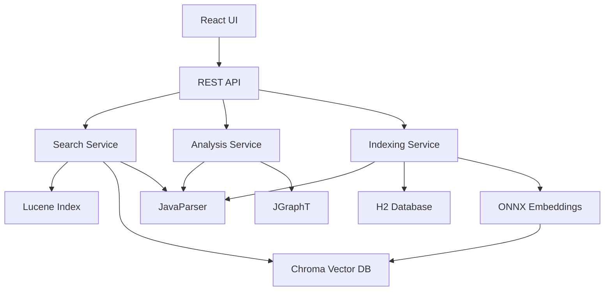

# Firestick - Developer 2 Tasks (Frontend Focus)

**Developer:** Developer 2 (Frontend Lead)  
**Version:** 1.0  
**Date:** October 14, 2025  
**Project:** Firestick - Legacy Code Analysis and Search Tool  
**Repository:** firestick (CaveAnimal/firestick)  
**Assignment:** Web UI, Desktop Packaging, User Experience

---

## Task Summary (DEV2)

**Total Tasks:** 0  
**Completed/Tested:** 0  
**In Progress:** 0  
**Blocked:** 0  
**Percent Complete:** 0%  
**Last Updated:** (not yet)

---

## Developer 2 Task Summary

**Role:** Frontend Development Lead  
**Primary Focus:** React UI, user experience, desktop packaging, deployment  
**Total Estimated Tasks:** ~873 tasks (50% of 1,747 total tasks)  
**Dependencies:** Coordinate with Developer 1 for API contracts and data requirements  

**Your Phases:**
- ✅ Phase 1: Foundation - Testing & Documentation (Weeks 1-2)
- 🔧 Phase 5: Web UI (Weeks 9-10)
- 🔧 Phase 6: Desktop Packaging (Weeks 10-11)
- 🔧 Phase 7: Optimization & Polish - Frontend Performance (Week 12)

**Developer 1's Phases (for reference):**
- Phase 1: Foundation - Backend Infrastructure (Weeks 1-2)
- Phase 2: Code Indexing Engine (Weeks 3-4)
- Phase 3: Search Engine (Weeks 5-6)
- Phase 4: Analysis Features (Weeks 7-8)
- Phase 7: Optimization & Polish - Backend Performance (Week 12)

---

## Coordination Points

### Week 2 (Day 9-10): API Contract Definition
**With Developer 1:**
- Define REST API endpoints together
- Agree on request/response schemas
- Document error codes and handling
- Create OpenAPI/Swagger specification
- Plan data structures for UI needs

### Week 8 (Day 38-40): Integration Checkpoint
**With Developer 1:**
- Verify backend APIs are ready for integration
- Test API responses with frontend expectations
- Coordinate error handling approaches
- Plan for Phase 5 UI development kickoff

### Week 12 (Day 68-69): Final Integration
**With Developer 1:**
- End-to-end testing across full stack
- Performance optimization coordination
- Bug fixes and final polish
- Final QA before release

---

## Task Status Symbols
- `[ ]` Not Started
- `[-]` In Progress
- `[X]` Completed
- `[V]` Tested & Verified
- `[!]` Blocked
- `[>]` Deferred (include reason on next line)

---

## Phase 1: Foundation - Testing & Documentation (Weeks 1-2)

**Your Responsibility:** Testing framework, documentation, project setup validation  
**Duration:** Oct 6-20, 2025 (2 weeks)  
**Parallel Work:** Developer 1 handles backend services and infrastructure

---

### Week 1: Testing Framework Setup

#### Day 1-3: Project Validation & Test Framework Setup
**Goal:** Ensure project setup is correct and establish testing foundation

- `[ ]` **Validate Project Setup** (2h)
  - `[ ]` Sub-task: Clone repository and verify structure
  - `[ ]` Sub-task: Verify Maven build works: `mvn clean install`
  - `[ ]` Sub-task: Verify application runs: `mvn spring-boot:run`
  - `[ ]` Sub-task: Check all dependencies are resolved
  - `[ ]` Sub-task: Verify Java 21 is being used
  - `[ ]` Sub-task: Document any setup issues

- `[ ]` **Set Up JUnit 5 Testing** (3h)
  - `[ ]` Sub-task: Verify JUnit 5 is in pom.xml
  - `[ ]` Sub-task: Add Mockito for mocking: `mockito-core` version 5.14.2
  - `[ ]` Sub-task: Add AssertJ for fluent assertions
  - `[ ]` Sub-task: Configure test resource directories
  - `[ ]` Sub-task: Create base test class with common setup
  - `[ ]` Sub-task: Run sample test to verify setup

**Test Dependencies:**
```xml
<!-- Add to pom.xml -->
<dependencies>
    <!-- JUnit 5 -->
    <dependency>
        <groupId>org.junit.jupiter</groupId>
        <artifactId>junit-jupiter</artifactId>
        <scope>test</scope>
    </dependency>
    
    <!-- Mockito -->
    <dependency>
        <groupId>org.mockito</groupId>
        <artifactId>mockito-core</artifactId>
        <version>5.14.2</version>
        <scope>test</scope>
    </dependency>
    
    <!-- AssertJ -->
    <dependency>
        <groupId>org.assertj</groupId>
        <artifactId>assertj-core</artifactId>
        <version>3.24.2</version>
        <scope>test</scope>
    </dependency>
    
    <!-- Spring Boot Test -->
    <dependency>
        <groupId>org.springframework.boot</groupId>
        <artifactId>spring-boot-starter-test</artifactId>
        <scope>test</scope>
    </dependency>
</dependencies>
```

- `[ ]` **Create Test Utilities** (3h)
  - `[ ]` Sub-task: Create `TestDataBuilder` class for test data
  - `[ ]` Sub-task: Create sample Java files for testing
  - `[ ]` Sub-task: Create helper methods for common test operations
  - `[ ]` Sub-task: Set up test configuration files
  - `[ ]` Sub-task: Document testing standards and conventions

**Test Utilities Example:**
```java
// src/test/java/com/codetalker/firestick/TestDataBuilder.java
package com.codetalker.firestick;

import java.nio.file.Path;
import java.nio.file.Files;
import java.io.IOException;

public class TestDataBuilder {
    
    public static Path createTempJavaFile(String className, String content) throws IOException {
        Path tempFile = Files.createTempFile(className, ".java");
        Files.writeString(tempFile, content);
        return tempFile;
    }
    
    public static String sampleClassCode(String className) {
        return """
            package com.example;
            
            public class %s {
                private String name;
                
                public %s(String name) {
                    this.name = name;
                }
                
                public String getName() {
                    return name;
                }
                
                public void setName(String name) {
                    this.name = name;
                }
            }
            """.formatted(className, className);
    }
    
    public static String sampleMethodCode() {
        return """
            public int calculate(int a, int b) {
                int result = 0;
                for (int i = 0; i < a; i++) {
                    result += b;
                }
                return result;
            }
            """;
    }
}
```

---

#### Day 4-5: Integration Test Setup
**Goal:** Set up integration testing infrastructure

- `[ ]` **Configure Integration Tests** (3h)
  - `[ ]` Sub-task: Create integration test package structure
  - `[ ]` Sub-task: Add `@SpringBootTest` annotation configuration
  - `[ ]` Sub-task: Set up test database (H2 in-memory)
  - `[ ]` Sub-task: Configure test application properties
  - `[ ]` Sub-task: Create base integration test class
  - `[ ]` Sub-task: Write sample integration test

**Integration Test Configuration:**
```java
// src/test/java/com/codetalker/firestick/integration/BaseIntegrationTest.java
package com.codetalker.firestick.integration;

import org.springframework.boot.test.context.SpringBootTest;
import org.springframework.test.context.TestPropertySource;
import org.junit.jupiter.api.extension.ExtendWith;
import org.springframework.test.context.junit.jupiter.SpringExtension;

@ExtendWith(SpringExtension.class)
@SpringBootTest(webEnvironment = SpringBootTest.WebEnvironment.RANDOM_PORT)
@TestPropertySource(locations = "classpath:application-test.properties")
public abstract class BaseIntegrationTest {
    // Common setup for all integration tests
}
```

```properties
# src/test/resources/application-test.properties
spring.datasource.url=jdbc:h2:mem:testdb
spring.datasource.driverClassName=org.h2.Driver
spring.jpa.hibernate.ddl-auto=create-drop
spring.jpa.show-sql=true
logging.level.root=INFO
```

- `[ ]` **Set Up Test Coverage** (2h)
  - `[ ]` Sub-task: Add JaCoCo plugin to pom.xml
  - `[ ]` Sub-task: Configure coverage thresholds
  - `[ ]` Sub-task: Generate coverage report: `mvn test jacoco:report`
  - `[ ]` Sub-task: View coverage in `target/site/jacoco/index.html`
  - `[ ]` Sub-task: Document coverage goals (aim for >80%)

**JaCoCo Configuration:**
```xml
<!-- Add to pom.xml -->
<build>
    <plugins>
        <plugin>
            <groupId>org.jacoco</groupId>
            <artifactId>jacoco-maven-plugin</artifactId>
            <version>0.8.11</version>
            <executions>
                <execution>
                    <goals>
                        <goal>prepare-agent</goal>
                    </goals>
                </execution>
                <execution>
                    <id>report</id>
                    <phase>test</phase>
                    <goals>
                        <goal>report</goal>
                    </goals>
                </execution>
                <execution>
                    <id>jacoco-check</id>
                    <goals>
                        <goal>check</goal>
                    </goals>
                    <configuration>
                        <rules>
                            <rule>
                                <element>PACKAGE</element>
                                <limits>
                                    <limit>
                                        <counter>LINE</counter>
                                        <value>COVEREDRATIO</value>
                                        <minimum>0.80</minimum>
                                    </limit>
                                </limits>
                            </rule>
                        </rules>
                    </configuration>
                </execution>
            </executions>
        </plugin>
    </plugins>
</build>
```

- `[ ]` **Create API Test Suite** (3h)
  - `[ ]` Sub-task: Set up REST API testing with MockMvc
  - `[ ]` Sub-task: Create test for health endpoint
  - `[ ]` Sub-task: Add tests for future search endpoints
  - `[ ]` Sub-task: Add tests for error scenarios
  - `[ ]` Sub-task: Document API testing patterns

**API Test Example:**

```java
// src/test/java/com/codetalker/firestick/controller/HealthControllerTest.java
package com.codetalker.firestick.controller;

import com.codetalker.firestick.controller.HealthController;
import org.junit.jupiter.api.Test;
import org.springframework.beans.factory.annotation.Autowired;
import org.springframework.boot.test.autoconfigure.web.servlet.WebMvcTest;
import org.springframework.test.web.servlet.MockMvc;

import static org.springframework.test.web.servlet.request.MockMvcRequestBuilders.get;
import static org.springframework.test.web.servlet.result.MockMvcResultMatchers.*;

@WebMvcTest(HealthController.class)
class HealthControllerTest {

    @Autowired
    private MockMvc mockMvc;

    @Test
    void healthEndpoint_ShouldReturnOK() throws Exception {
        mockMvc.perform(get("/health"))
                .andExpect(status().isOk())
                .andExpect(content().string("OK"));
    }
}
```

---

### Week 2: Documentation & Planning

#### Day 6-7: Documentation Setup
**Goal:** Create comprehensive project documentation structure

- `[ ]` **Create README.md** (3h)
  - `[ ]` Sub-task: Add project overview and description
  - `[ ]` Sub-task: Add system requirements
  - `[ ]` Sub-task: Add installation instructions
  - `[ ]` Sub-task: Add quick start guide
  - `[ ]` Sub-task: Add build instructions
  - `[ ]` Sub-task: Add contribution guidelines
  - `[ ]` Sub-task: Add license information

**README Template:**
```markdown
# Firestick - Legacy Code Analysis and Search Tool

## Overview
Firestick is a powerful desktop application for analyzing and searching legacy codebases using semantic search, code metrics, and dependency analysis.

## Features
- 🔍 Semantic code search with AI embeddings
- 📊 Code complexity analysis
- 🕸️ Dependency graph visualization
- 💡 Code smell detection
- 🎯 Dead code identification
- 🖥️ Modern web-based UI

## System Requirements
- Java 21+
- Maven 3.8+
- Node.js 18+ (for UI development)
- 4GB RAM recommended

## Quick Start

### Build and Run
```bash
# Clone repository
git clone https://github.com/CaveAnimal/firestick.git
cd firestick

# Build backend
mvn clean package

# Run application
mvn spring-boot:run

# Access UI at http://localhost:8080
```

### Development Setup
See [DEVELOPMENT.md](docs/DEVELOPMENT.md) for detailed setup instructions.

## Documentation
- [User Guide](docs/USER_GUIDE.md)
- [Developer Guide](docs/DEVELOPER_GUIDE.md)
- [API Documentation](docs/API.md)
- [Architecture](docs/ARCHITECTURE.md)

## Contributing
See [CONTRIBUTING.md](CONTRIBUTING.md)

## License
MIT License - see [LICENSE](LICENSE)
```

- `[ ]` **Create docs/ Directory Structure** (2h)
  - `[ ]` Sub-task: Create `docs/` directory
  - `[ ]` Sub-task: Create `ARCHITECTURE.md` (placeholder)
  - `[ ]` Sub-task: Create `DEVELOPER_GUIDE.md` (placeholder)
  - `[ ]` Sub-task: Create `USER_GUIDE.md` (placeholder)
  - `[ ]` Sub-task: Create `API.md` (placeholder)
  - `[ ]` Sub-task: Create `CONTRIBUTING.md`

- `[ ]` **Document Architecture** (3h)
  - `[ ]` Sub-task: Create high-level architecture diagram
  - `[ ]` Sub-task: Document technology stack
  - `[ ]` Sub-task: Document data flow
  - `[ ]` Sub-task: Document component relationships
  - `[ ]` Sub-task: Document design decisions
  - `[ ]` Sub-task: Add diagrams (using Mermaid or draw.io)

**Architecture Diagram Example (Mermaid):**
```markdown
# Architecture

## System Overview



## Components

### Frontend
- **React 18**: Modern UI framework
- **Material-UI**: Component library
- **Monaco Editor**: Code viewer
- **React Flow**: Graph visualization

### Backend
- **Spring Boot 3.5**: Application framework
- **JavaParser**: Code parsing
- **Apache Lucene**: Full-text search
- **JGraphT**: Dependency graphs

### Data Layer
- **H2 Database**: Code metadata storage
- **Chroma**: Vector similarity search
- **ONNX Runtime**: Embedding generation
```

#### Day 8: API Contract Planning
**Goal:** Plan API contracts with Developer 1

- `[ ]` **Design API Endpoints** (3h - COORDINATION)
  - `[ ]` Sub-task: Meet with Developer 1 to design API
  - `[ ]` Sub-task: Document search endpoints
  - `[ ]` Sub-task: Document analysis endpoints
  - `[ ]` Sub-task: Document indexing endpoints
  - `[ ]` Sub-task: Document file access endpoints
  - `[ ]` Sub-task: Define request/response schemas

**API Contract Example:**
```yaml
# API Contract (OpenAPI/Swagger format)

/api/search:
  post:
    summary: Search code
    requestBody:
      content:
        application/json:
          schema:
            type: object
            properties:
              query:
                type: string
                description: Search query
              topK:
                type: integer
                description: Number of results
                default: 10
              filter:
                type: object
                description: Optional filters
    responses:
      200:
        description: Search results
        content:
          application/json:
            schema:
              type: object
              properties:
                results:
                  type: array
                  items:
                    type: object
                    properties:
                      id: string
                      content: string
                      filePath: string
                      lineNumber: integer
                      score: number

/api/analysis/complexity:
  get:
    summary: Get complexity metrics
    responses:
      200:
        description: Complexity analysis
        content:
          application/json:
            schema:
              type: object
              properties:
                average: number
                max: number
                histogram: object
```

- `[ ]` **Create API Mock Data** (2h)
  - `[ ]` Sub-task: Create mock responses for search
  - `[ ]` Sub-task: Create mock responses for analysis
  - `[ ]` Sub-task: Create mock responses for graph data
  - `[ ]` Sub-task: Save mocks for frontend development
  - `[ ]` Sub-task: Document mock data usage

- `[ ]` **Document Error Handling** (1h)
  - `[ ]` Sub-task: Define error response format
  - `[ ]` Sub-task: Document error codes
  - `[ ]` Sub-task: Document error messages
  - `[ ]` Sub-task: Plan frontend error handling
  - `[ ]` Sub-task: Create error handling guide

---

#### Day 9-10: UI Planning & Design
**Goal:** Plan UI architecture and design system

- `[ ]` **Create UI Wireframes** (3h)
  - `[ ]` Sub-task: Sketch search page layout
  - `[ ]` Sub-task: Sketch analysis dashboard layout
  - `[ ]` Sub-task: Sketch code viewer layout
  - `[ ]` Sub-task: Sketch dependency graph layout
  - `[ ]` Sub-task: Sketch settings page layout
  - `[ ]` Sub-task: Use Figma, draw.io, or pen & paper

- `[ ]` **Define Design System** (3h)
  - `[ ]` Sub-task: Choose color palette
  - `[ ]` Sub-task: Define typography scale
  - `[ ]` Sub-task: Define spacing system
  - `[ ]` Sub-task: Choose UI component library (Material-UI recommended)
  - `[ ]` Sub-task: Document design tokens
  - `[ ]` Sub-task: Create design system reference

**Design System Example:**
```javascript
// theme.js - Design tokens
export const theme = {
  colors: {
    primary: '#2196f3',
    secondary: '#f50057',
    success: '#4caf50',
    warning: '#ff9800',
    error: '#f44336',
    background: '#fafafa',
    surface: '#ffffff',
    text: {
      primary: 'rgba(0, 0, 0, 0.87)',
      secondary: 'rgba(0, 0, 0, 0.54)',
      disabled: 'rgba(0, 0, 0, 0.38)',
    },
  },
  spacing: {
    xs: '4px',
    sm: '8px',
    md: '16px',
    lg: '24px',
    xl: '32px',
  },
  typography: {
    fontFamily: '"Roboto", "Helvetica", "Arial", sans-serif',
    h1: { fontSize: '2.5rem', fontWeight: 500 },
    h2: { fontSize: '2rem', fontWeight: 500 },
    h3: { fontSize: '1.75rem', fontWeight: 500 },
    body1: { fontSize: '1rem', fontWeight: 400 },
    body2: { fontSize: '0.875rem', fontWeight: 400 },
  },
};
```

- `[ ]` **Plan Component Structure** (2h)
  - `[ ]` Sub-task: List all UI components needed
  - `[ ]` Sub-task: Define component hierarchy
  - `[ ]` Sub-task: Plan reusable components
  - `[ ]` Sub-task: Document component responsibilities
  - `[ ]` Sub-task: Create component diagram

**Component List:**
```
Layout Components:
- AppLayout (header, sidebar, main)
- Header
- Sidebar
- Footer

Search Components:
- SearchPage
- SearchInput (with autocomplete)
- SearchFilters
- SearchResults
- ResultCard

Code Viewer Components:
- CodeViewer (Monaco Editor wrapper)
- CodeNavigation
- FileBreadcrumb

Analysis Components:
- AnalysisDashboard
- ComplexityWidget
- CodeSmellsWidget
- DeadCodeWidget
- QualityScoreCard

Graph Components:
- DependencyGraph
- GraphControls
- GraphLegend

Settings Components:
- SettingsPage
- IndexingSettings
- SearchSettings
- AppearanceSettings

Common Components:
- Button
- Input
- Select
- Checkbox
- Modal
- Toast/Notification
- Loading (skeleton, spinner)
- ErrorBoundary
```

---

## Phase 5: Web UI (Weeks 9-10)

**Your Responsibility:** Complete React web interface  
**Duration:** Dec 9 - Dec 22, 2025 (2 weeks)  
**Dependencies:** Backend APIs from Phase 3 and Phase 4 must be ready

(Include all UI tasks from original firestickTASKS.md Phase 5 - Days 43-54)

---

## Phase 6: Desktop Packaging (Weeks 10-11)

**Your Responsibility:** Desktop packaging, installers, deployment  
**Duration:** Dec 22, 2025 - Jan 4, 2026 (2 weeks)  
**Dependencies:** Phase 5 (Web UI) complete

(Include all packaging tasks from original firestickTASKS.md Phase 6 - Days 55-62)

---

## Phase 7: Optimization & Polish - Frontend (Week 12)

**Your Responsibility:** Frontend performance, UX polish, accessibility  
**Duration:** Jan 5-11, 2026 (1 week)

### Day 64: Frontend Performance Optimization
- `[ ]` Optimize React Bundle Size (2h)
- `[ ]` Optimize React Rendering (3h)
- `[ ]` Optimize API Calls (2h)
- `[ ]` Add Loading Optimizations (1h)

### Day 65: User Experience Improvements
- `[ ]` Improve Error Handling (2h)
- `[ ]` Add Keyboard Shortcuts (2h)
- `[ ]` Improve Loading States (2h)
- `[ ]` Add User Feedback (2h)

### Day 66: Accessibility & Browser Compatibility
- `[ ]` Accessibility Audit (3h)
- `[ ]` Cross-Browser Testing (2h)
- `[ ]` Mobile Responsiveness (2h)
- `[ ]` Add Print Styles (1h)

### Day 69: UI Polish
- `[ ]` Fix alignment and spacing issues (2h)
- `[ ]` Ensure consistent styling (1h)
- `[ ]` Improve animations and transitions (1h)

---

## Daily Standup Template

**Today's Focus:**
- [ ] Task 1
- [ ] Task 2
- [ ] Task 3

**Coordination with Developer 1:**
- [ ] Backend API status check
- [ ] Data format discussions
- [ ] Integration issues

**Blockers:**
- None / [List blockers]

**Notes:**
- [Any important notes or decisions]

---

**Last Updated:** October 14, 2025  
**Next Review:** [Date]  
**Questions:** Contact Developer 1 for backend/API questions
